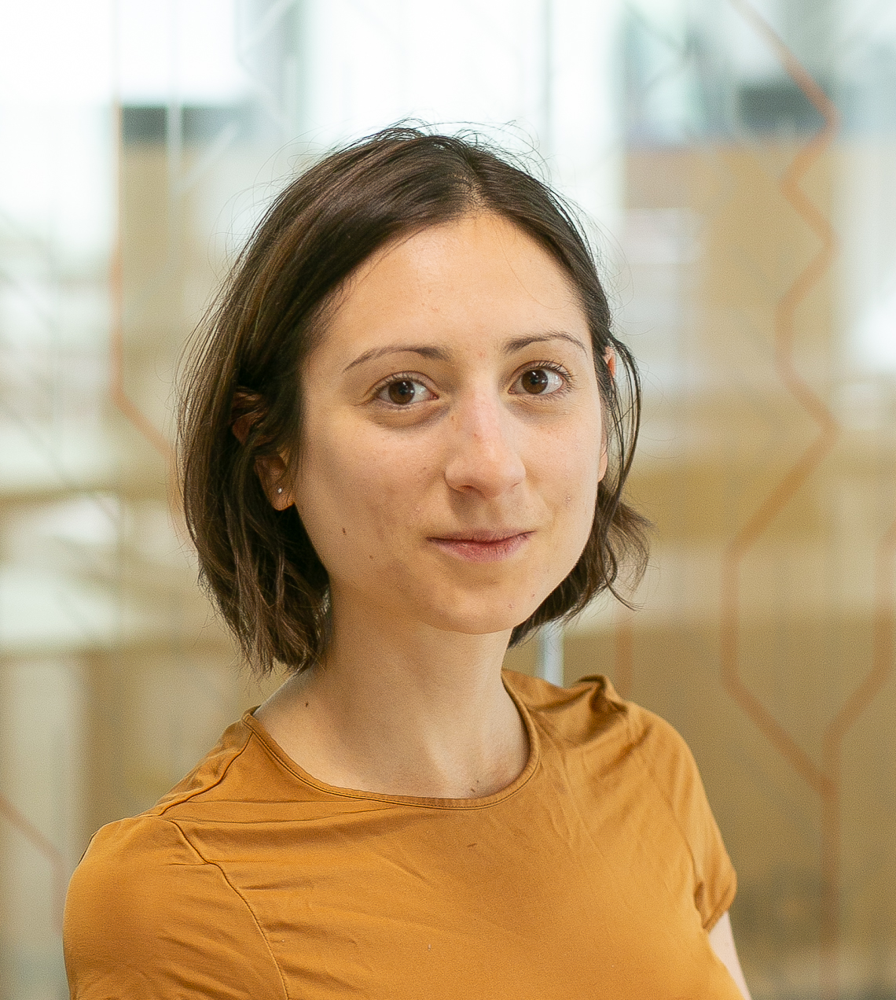

---
# Feel free to add content and custom Front Matter to this file.
# To modify the layout, see https://jekyllrb.com/docs/themes/#overriding-theme-defaults

layout: home
text-align: justify

---

  

## News

- I will be giving a talk at the [BayesComp 2025 conference](https://bayescomp2025.sg/) in the session ``High-dimensional Discrete Model Search'' on June 19 (10.20 am).
- I will be giving a talk at the [Royal Statistical Society 2025 International Conference](https://rss.org.uk/training-events/conference-2025/) in the session ``Change-point detection on dynamic networks'' on September 3.

<!-- In July 2024, I started as an Assistant Professor (tenure-track) of Data Science in the [Faculty of Informatics](https://www.inf.usi.ch/en) at the Universita della Svizzera Italiana.
- In September 2024, I will be giving a talk at the [BIRS workshop "Frontiers of Bayesian Inference and Data Science"](https://www.birs.ca/events/2024/5-day-workshops/24w5196). -->

<!-- in Statistics and Machine Learning at the [Barcelona School of Economics](https://bse.eu/) and [Universitat Pompeu Fabra](https://www.upf.edu/), in the [Statistics group](https://sites.google.com/view/stats-upf/), working with [Prof. David Rossell](https://sites.google.com/site/rosselldavid) and [Prof. Gabor Lugosi](http://www.econ.upf.edu/~lugosi/) -->

## About me

I am an Assistant Professor (tenure-track) of Data Science in the [Faculty of Informatics](https://www.inf.usi.ch/en) at the Universita della Svizzera Italiana. [Here](https://www.ci.inf.usi.ch/research/hicoda/) is my institutional homepage at the Computing Institute.

My research interests include **graphs/networks**,  **point processes**, **Bayesian inference**, **high-dimensional and nonparametric statistics**, **explainability and fairness in machine learning**.

I obtained my Ph.D. from the [Department of Statistics](http://www.stats.ox.ac.uk/) at the University of Oxford in 2023, under the supervision of [Judith Rousseau](http://www.stats.ox.ac.uk/~rousseau/), [Mihai Cucuringu](http://www.stats.ox.ac.uk/~cucuringu), [Xiaowen Dong](https://web.media.mit.edu/~xdong/) and [Vincent Rivoirard](https://www.ceremade.dauphine.fr/~rivoirar/). I was then a postdoctoral researcher at the [Barcelona School of Economics](https://bse.eu/) and [Universitat Pompeu Fabra](https://www.upf.edu/) where I worked with [David Rossell](https://sites.google.com/site/rosselldavid/) and [Gàbor Lugosi](https://www.upf.edu/web/gabor-lugosi). I joined my current position in 2024 and lead the [Statistical Science Laboratory](https://www.ci.inf.usi.ch/research/hicoda/).

<!--  My [Ph.D. thesis](https://ora.ox.ac.uk/objects/uuid:7a4b5a4d-ff38-462b-a068-f93c8237de2f) is entitled "Flexible estimation of temporal point processes and graphs" -->

**If you wish to contact me, please use my new address: deborah [dot] sulem [at] usi [dot] ch**
